# Bridgend Eagles Team Website
(by Morgan Jenkins)

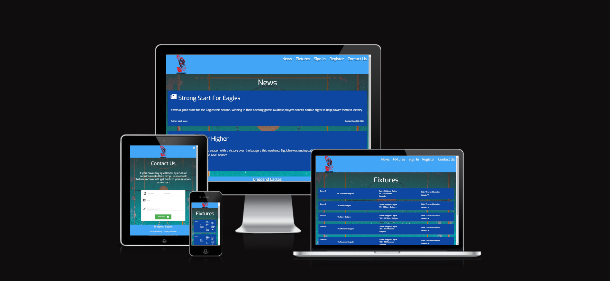

## Table of Contents

1. [Project Goals](#project-goals)
    1. [User Goals](#user-goals)
    2. [Site Owner Goals](#site-owner-goals)
2. [User Experience](#user-experience)
    1. [Target Audience](#target-audience)
    2. [User Requirements and Expectations](#user-requrements-and-expectations)
    3. [User Stories](#user-stories)
    4. [Scope](#scope)
3. [Design of Site](#design-of-site)
    1. [Initial Idea](#initial-idea)
    2. [Wireframes](#wireframes)
    3. [Site Layout](#site-layout)
    4. [Colour Choices](#colour-choices)
    5. [Fonts](#fonts)
    6. [Database Structure](#database-structure)
    7. [MongoDB Collection](#mongodb-collections)
4. [Technologies Implemented](#technologies-implemented)
    1. [Languages](#languages)
    2. [Tools](#tools)
5. [Site Features](#site-features)
6. [Testing](#testing)
    1. [Validation](#validation)
        1. [HTML Validation](#html-validation)
        2. [CSS Validation](#css-validation)
        3. [JavaScript Validation](#javascript-validation)
    2. [Performance and Accessibility](#performance-and-accessibility)
    3. [Device Tests](#device-tests)
    4. [Responsiveness](#responsiveness)
    5. [User Story Tests](#user-story-tests)
7. [Bug Squashing](#bug-squashing)
8. [Deployment](#deployment)
    * [Deploying to Github Pages](#deploying-to-github-pages)
    * [Forking the githubrepository](#forking-the-github-repository)
    * [Cloning the repository](#cloning-the-github-repository)
9. [Credits](#credits)
10. [Thank You](#thank-you)

## Project Goals

### User Goals

* To read the latest news on the Bridgend Eagles basketball team.
* To view upcoming and past fixtures for the Bridgend Eagles basketball team.
* To sign up to the site as a registered user.
* To send an email to the site owner through a dedicated contact form.
* Once signed in, to be able to view the players of the team along with their stats.

### Site Owner Goals

* To have access to the admin account.
* To view, add, update and delete articles.
* To view, add, update and delete players.
* To view, add, update and delete fixtures.

## User Experience

### Target Audience

* Fans of the Bridgend Eagles Basketball. team.
* Players of the Bridgend Eagles Basketbal teaml
* People who wish to join the Bridgend Eagles Basketball team.
* Senior memebership/administrators of the team.

### User Requirements and Expectations

* Easy to navigate site and intuitive design.
* Clear and simple information about the team.
* The ability to interact with all information stored in the database relevant to the team following the CRUD methodology.
* Responsive design that adapts to mobile, tablet and desktop.
* Easy to fill out contact form.

### User Stories
#### First-time User 

1. I want to view news relevant to the Bridgend Eagles basketball team.
2. I want to view the fixtures for the Bridgend Eagles basketball team.
3. I want to see the training times for team.
4. I want to contact the team via email.
5. I want to register as a user to the site.
6. I want to view social media relevant to the team.

#### Returning User

7. I want to view the fixtures for the Bridgend Eagles basketball team.
8. I want to see the training times for team.
9. I want to sign into the site using a created account.
10. I want to view the players on the team and their statistics.

#### Site Owner 

11. I want to add new articles.
12. I want to edit existing articles.
13. I want to delete an article.
14. I want to add new fixtures.
15. I want to edit existing fixtures.
16. I want to delete a fixture.
17. I want to add new players.
18. I want to edit existing players.
19. I want to delete a player.
20. I want to sign into an account with admin permissions.
21. I want to receive emails from users that fill out the relevant form.

## Scope

The scope of the project in it’s first release is defined by the following features:

* Landing page with a clear navigation menu that can take unregistered users to News, Fixtures and a Contact form.
* Site must connect to MongoDB and display documents from the collection in a clear front end manner.
* Registered users can see player information. This protects personal information from unregistered users.
* Admin account is able to interact with all database information displayed using CRUD functionality.
* Allow User to sign in to the site or register if they are not already.
* Fully functional contact form with emailJS that will not submit unless all fields are filled out.
* A 404 error page that is styled and allows navigation back to the main page.
* A 500 error page in the event of a server error that is fully styled and directs back to the main page.
* Clear favicon that shows the site logo.

## Design of Site

### Initial idea

The main purpose of this site was to create a front end that would display collections from MongoDB. I decided to create a fake basketball team called the Bridgend Eagles (my local town). The Database would display news articles, players and fixtures of the team. An admin account would have permissions to update, delete and create new records. It would be fully responsive for desktop, tablet and mobile and would have a connection to the emailJS API to allow users to contact the site owner.

### Wireframes

To create the wireframes for this site I used the balsamiq cloud service. This allowed me to create a more basic wireframe. This was helpful as I have found in the past having a more complex and detailed wireframe to be quite restricting. 

Home Page Wireframe (news) - Mobile

 

Home Page Wireframe (news) - Tablet

 

Home Page Wireframe (news) - Desktop

 

Players Page - Mobile

 

Players Page Wireframe - Tablet

 

Players Page Wireframe - Desktop

 

Fixtures Page Wireframe - Mobile

 

Fixtures Page Wireframe - Tablet

 

Fixtures Page Wireframe - Desktop

 

Contact Page Wireframe - Mobile

 

Contact Page Wireframe - Tablet

 

Contact Page Wireframe - Desktop

 

### Site Layout

The Site will have four main pages and these will be the news page, fixtures page, players page and contact page. 
These pages will be accessed via a nav bar at the top of the page. 
There will be two other sub pages; a registration page and a sign in page and one more link in the nav bar where users can sign out.

The design of the site will be achieved using the materialize framework.

#### Navigation Bar
The first thing that a user will see when they enter the site is the navigation bar. This will be made consistent across the whole site lending cohesion and familiarity and allowing all pages to be accessed without using the back button. It consists of a bar containing the navigation links and the logo for the site. The logo acts as an additional link for the index/news page. The nav bar is fully responsive and collapses into a hamburger icon with a pop out navigation list on any device tablet sized or smaller.

Navigation Bar

 

#### Footer-

The footer of the page is another section which remains consistent throught the site. This informs the user that they have reached the bottom of the site and there is no more content. I have also included some useful information in the footer, such as a repeat of the team name, the training times of the team and links to social media sites.

Footer

 

#### News Page

The news page contains a series of cards styled from the Materialize framework that displays the news articles created by the site admin. The information on the cards is input through a front end form that the admin can access by clicking the 'add article' button. Once the form has been filled out the admin can submit the form which will then insert that information into a MongoDB collection which is then displayed on the news page in a new card. 

The admin also has access to an edit article button where they can change any part of the article posted aside from the date which will always be the current date. Furthermore there is a delete article button on the edit article page which will completely remove the object from the MongoDB collection. 

On both the add article and edit article page there is a cancel link which returns the admin to the display articles page.

News Page- Gif

 

Add Article Page- Gif

 

Edit Article- Gif

 

Delete Article- Gif

 

#### Fixtures Page

The fixtures page contains an accordion styled list from the Materialize framework that display the fixtures created by the site admin. The information in the accordion is input through a front end form that the admin can access by clicking the 'add fixture' button. Once the form has been filled out the admin can submit the form which will then insert that information into a MongoDB collection which is then displayed on the fixture page as a new section on the accordion list. The accordion list is sorted by the game number.

The admin also has access to an edit fixture button where they can change any part of the article posted. Furthermore there is a delete fixture button on the edit article page which will completely remove the object from the MongoDB collection. 

On both the add fixture and edit fixture page there is a cancel link which returns the admin to the display articles page.

Fixtures Page- Gif

 

Add Fixture Page- Gif

 

Edit Fixture- Gif

 

Delete Fixture- Gif

 

#### Players Page

The players page contains a series of cards styled from the Materialize framework that displays the players Profile photo and information (The cards can be clicked on to display further relevant atatistics) created by the site admin. The information on the cards is input through a front end form that the admin can access by clicking the 'add player' button. The profile photo has a default value which inputs a placeholder image until the site admin can provide an appropriate link for an image (I have used imgur in this instance however any image hosting site should suffice). Once the form has been filled out the admin can submit the form which will then insert that information into a MongoDB collection which is then displayed on the players page in a new card. 

The admin also has access to an edit player button where they can change any part of the player posted. Furthermore there is a delete player button on the edit player page which will completely remove the object from the MongoDB collection. 

On both the add player and edit player page there is a cancel link which returns the admin to the display players page.

As a protection measure only registered users can view the Players page to protect personal information, as part of a further release any attempt to register will have to be approved by the site admin.

Players Page- Gif

 

Add Player Page- Gif

 

Edit Player- Gif

 

Delete Player- Gif

 

#### Contact Page

The contact Page is for users to get in contact with the site owner. There is a form to be filled out where they provide first name, last name, email address and then a message to the site owner. Upon pressing submit an alert pops up to inform them that the message has been sent and the form will then reset.

This page uses the emailJS API to facilitate sending the form as an email.

Contact Page- Gif

 

#### SignIn and Registration Pages

These two pages are very similar in structure. They both contain a form for the user to fill out. They provide a username and password 

#### Sign Out Link- 

### Colour Choices

The colours for this website were decided on from the materialize colour pallet classes. The colours I decided on were the Blue-Lighten 1 selection.
I chose this as it was in keeping with the usual colour scheme for many Bridgend based sports teams in real life such as the Bridgend Ravens rugby team.  

### Fonts
The font used for the site is the "Exo" font as this had quite a bold and easy to read style whilst also being curved, thus giving the website an approachable feel.

## Technologies Implemented

### Languages

* HTML
* CSS
* JavaScript
* Python

### Tools

* Flask
* Materialize
* MongoDB
* Git
* GitHub
* CodeAnywhere
* Balsamiq
* Google Fonts
* Font Awesome
* Favicon.io
* Lucid Chart
* Figma Flowcharts
* Imgur
 

## Site Features

## Testing
    
### Validation

#### HTML Validation- W3C markup validation service was used to assess the validity of my HTML code.

HTML Validation of News Page

 

HTML Validation of Edit Article Page
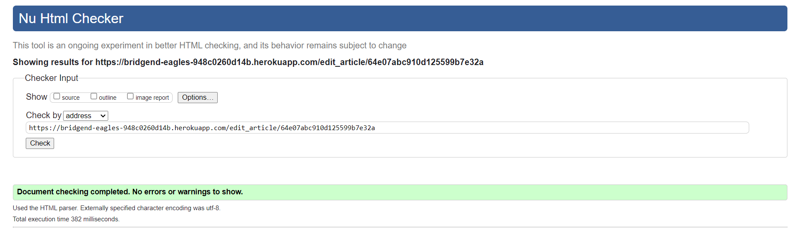
 

HTML Validation of Add Article Page
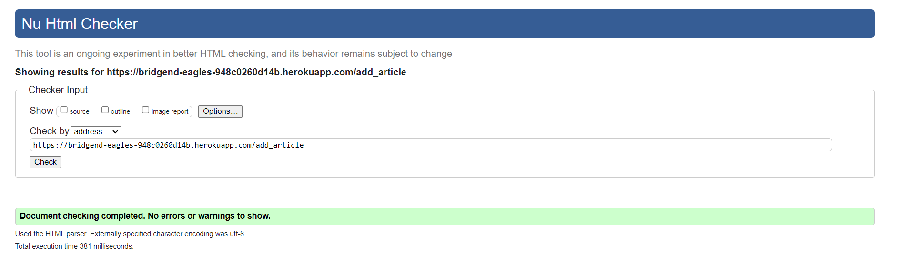
 

HTML Validation of Players Page
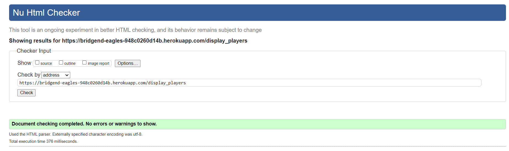
 

HTML Validation of Edit Players Page
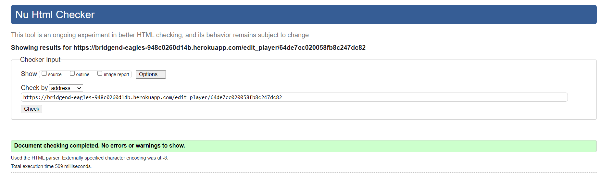
 

HTML Validation of Add Players Page
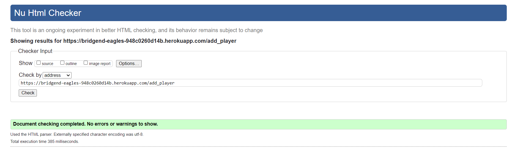
 

HTML Validation of Fixtures Page
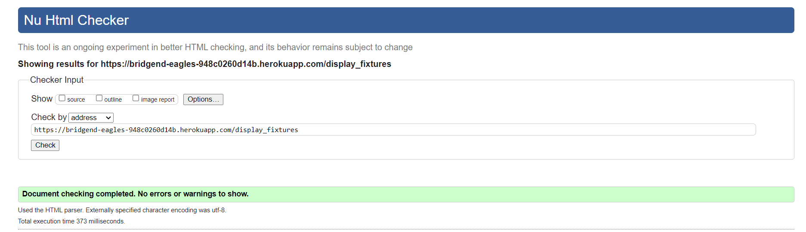
 

HTML Validation of Edit Fixtures Page
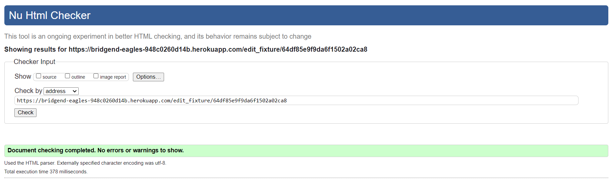
 

HTML Validation of Add Fixtures Page

 

HTML Validation of Contact Page
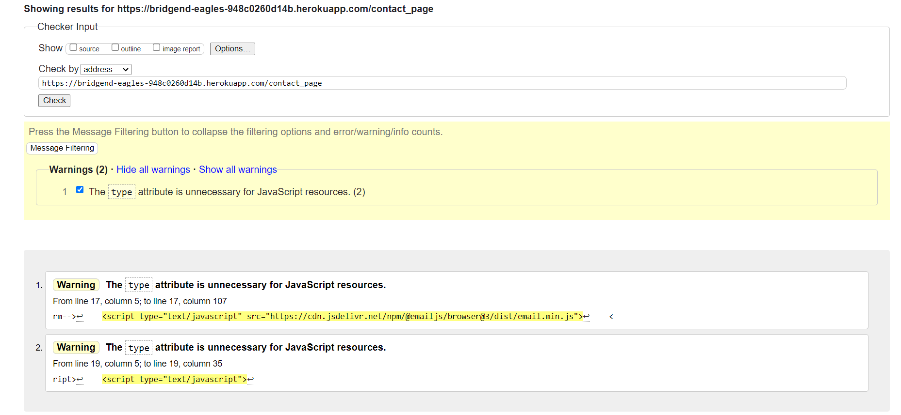
 

HTML Validation of SignIn Page
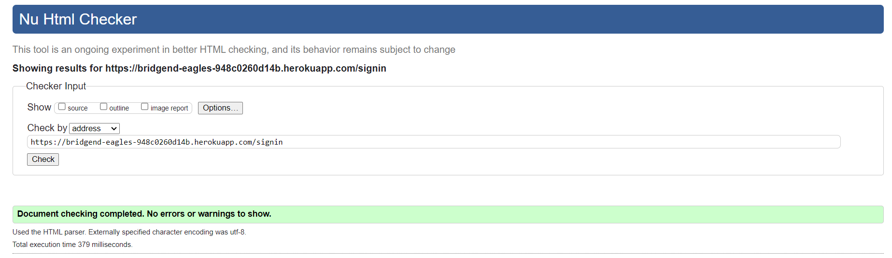
 

HTML Validation of Registration Page
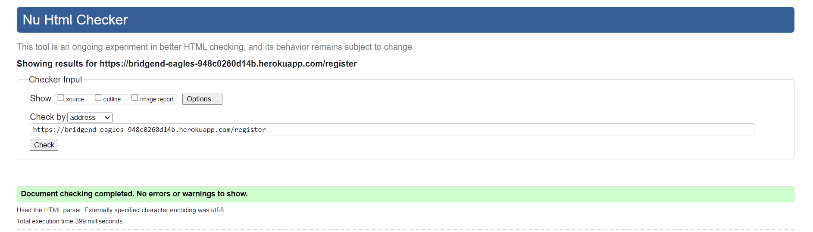
 

HTML Validation of 500 Page
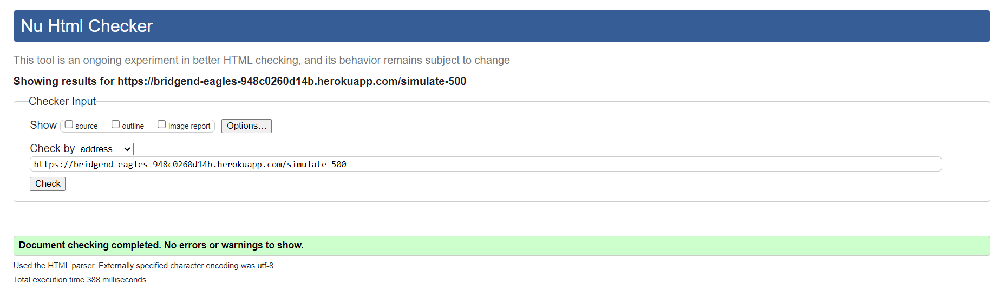
 

#### CSS Validation- W3C CSS validation service was used to assess the validity of my CSS code

CSS validation of whole site styling
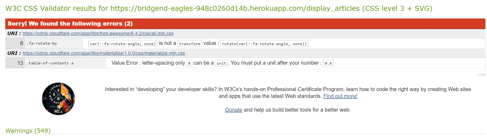
 

#### JavaScript Validation- JS hint was used to assess the validity of my scripts

Validation of custom scripts using JS hint
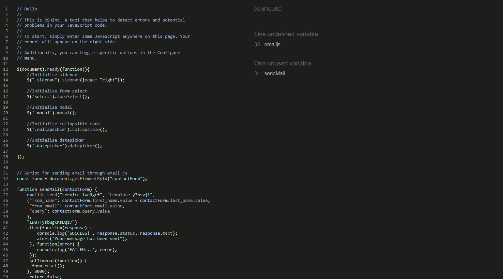
 

#### Python Validation- The CI python linter was used to assess the the validity of my python file

Validation of python file using CI python linter
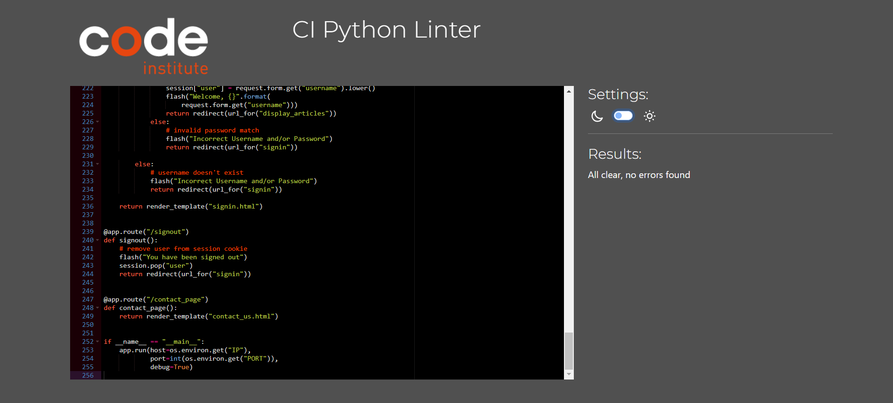
 

### Performance and Accessibility

Google Lighthouse as part of the Chrom dev tools was used to assess performance and accessibility.

Lighthouse Score of News Page
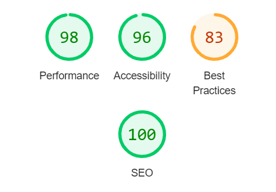
 

Lighthouse Score of Add Article Page

 

Lighthouse Score of Edit Article Page
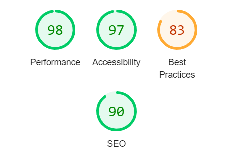
 

Lighthouse Score of Players Page
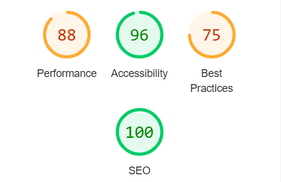
 

Lighthouse Score of Add Player Page

 

Lighthouse Score of Edit Player Page
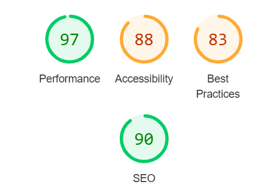
 

Lighthouse Score of Fixtures Page
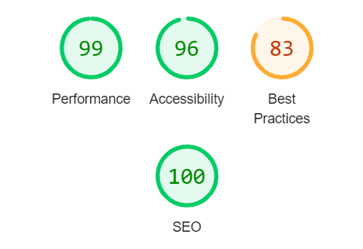
 

Lighthouse Score of Edit Fixtures Page
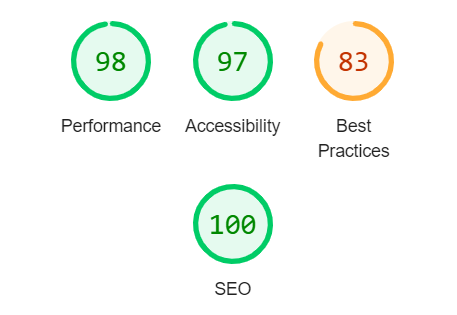
 

Lighthouse Score of Add Fixtures Page
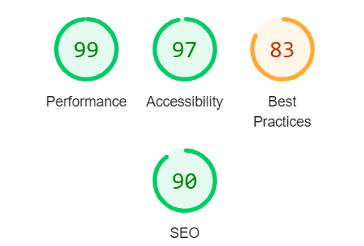
 

Lighthouse Score of Contact Page
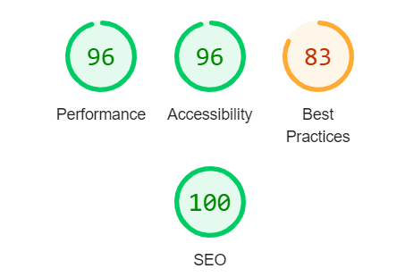
 

Lighthouse Score of SignIn Page

 

Lighthouse Score of Registration Page

 

### Device Tests

The website was tested on the following devices:
* Samsung Galaxy M31
* iPhone 12 Pro
* Ipad Pro 4th Gen
* Asus Vivobook laptop (X515JAB_X515JA)

### Responsiveness

[Responsinator](http://www.responsinator.com/?url=https%3A%2F%2Fbridgend-eagles-948c0260d14b.herokuapp.com%2Fdisplay_articles) was used to assess the responsiveness of the project. 

### User Story Tests

### First Time User

1. I want to view news relevant to the Bridgend Eagles basketball team.

| **Feature Used** | **User Action** | **Expectation** | **Result** |
| ---------------- | --------------- | --------------- | ---------- |
| Navigation Bar and News Page | Website opens on news page or user clicks on link in nav bar to navigate there | User should be directed to news page where they can scroll through published articles | Works as expected |

2. I want to view the fixtures for the Bridgend Eagles basketball team.

| **Feature Used** | **User Action** | **Expectation** | **Result** |
| ---------------- | --------------- | --------------- | ---------- |
| Navigation Bar and Fixtures Page | User clicks on fixtures on Nav bar and is directed to fixtures page. | User can scroll through the page to view the fixtures and the related details such as score, they can click on each fixture to see location details | Works as expected |

3. I want to see the training times for team.

| **Feature Used** | **User Action** | **Expectation** | **Result** |
| ---------------- | --------------- | --------------- | ---------- |
| Footer | User can scroll to the bottom of the page | At the bottom of the page is the footer which contains the teams training times. | Works as expected |

4. I want to contact the team via email.

| **Feature Used** | **User Action** | **Expectation** | **Result** |
| ---------------- | --------------- | --------------- | ---------- |
| Navigation Bar, Contact Us page | User clicks on contact link and is directed to a page with a form to fill out. | User can fill out form with Name, Email and Comments and submit that form which will then be automatically emailed to site owner via EmailJS functionality. | Works as expected |

5. I want to register as a user to the site.

| **Feature Used** | **User Action** | **Expectation** | **Result** |
| ---------------- | --------------- | --------------- | ---------- |
| Navigation Bar, Registration Page | User clicks on register link and is directed to a page with a form to fill out. | User can type a username and password for the site which upon submitting the form will register that username and password with the site for future sign in's | Works as expected |

6. I want to view social media relevant to the team.

| **Feature Used** | **User Action** | **Expectation** | **Result** |
| ---------------- | --------------- | --------------- | ---------- |
| Footer | User can scroll to the bottom of the page | Located in the footer are icons representing three social media sites which when clicked upon will direct the user to the relevant site | Works as expected, in a realistic release of site the links would be set to actual social media pages |

### Returning User

7. I want to view the fixtures for the Bridgend Eagles basketball team.

| **Feature Used** | **User Action** | **Expectation** | **Result** |
| ---------------- | --------------- | --------------- | ---------- |
| Navigation Bar and Fixtures Page | User clicks on fixtures on Nav bar and is directed to fixtures page. | User can scroll through the page to view the fixtures and the related details such as score, they can click on each fixture to see location details | Works as expected |

8. I want to see the training times for team.

| **Feature Used** | **User Action** | **Expectation** | **Result** |
| ---------------- | --------------- | --------------- | ---------- |
| Footer | User can scroll to the bottom of the page | At the bottom of the page is the footer which contains the teams training times. | Works as expected |

9. I want to sign into the site using a created account.

| **Feature Used** | **User Action** | **Expectation** | **Result** |
| ---------------- | --------------- | --------------- | ---------- |
| Navigation Bar, SignIn Page | User will click on sign in link in nav bar, this will then direct them to sign in page. User will then enter a username and password and submit. | User is redirected to news page with a flash message informing them they have successfully signed in | Works as expected |

10. I want to view the players on the team and their statistics.

| **Feature Used** | **User Action** | **Expectation** | **Result** |
| ---------------- | --------------- | --------------- | ---------- |
| Navigation Bar, players page | User clicks on the nav bar link for the players page. | User is redirected to player page. Once there the user can scroll through the listed players and upon clicking on the player card a list of statistics will be displayed. | Works as expected |

### Site Owner 

11. I want to add new articles.

| **Feature Used** | **User Action** | **Expectation** | **Result** |
| ---------------- | --------------- | --------------- | ---------- |
| Articles page, add articles button, add articles page | Admin has access to add article button which can be clicked | Admin is redirected to add article page with a form to fill out. Once filled the admin can submit the form which will post to the database and is accessed by the front end site to be displayed. The Admin is redirected to the articles page and a flash message is displayed informing them that the article has been successfully added | Works as expected |

12. I want to edit existing articles.

| **Feature Used** | **User Action** | **Expectation** | **Result** |
| ---------------- | --------------- | --------------- | ---------- |
| Articles page, edit articles button, edit articles page | Admin has access to edit article button which can be clicked | Admin is redirected to edit article page with a form prepopulated with fields from the article being edited. Once completed the admin can submit the form which will update the database and is accessed by the front end site to be displayed. The Admin is redirected to the articles page and a flash message is displayed informing them that the article has been successfully edited | Works as expected |

13. I want to delete an article.

| **Feature Used** | **User Action** | **Expectation** | **Result** |
| ---------------- | --------------- | --------------- | ---------- |
| Edit articles page, delete article button | Admin clicks on delete article button | After clicking on delete article button a modal will appear asking the admin to confirm the delete request. If yes is selected then the admin is redirected to the article page with a flash message informing the admin that the article has been successfully deleted. The article has now been removed from the database | Works as expected |

14. I want to add new fixtures.

| **Feature Used** | **User Action** | **Expectation** | **Result** |
| ---------------- | --------------- | --------------- | ---------- |
| Fixtures page, add fixture button, add fixture page | Admin has access to add fixture button which can be clicked | Admin is redirected to add fixture page with a form to fill out. Once filled the admin can submit the form which will post to the database and is accessed by the front end site to be displayed. The Admin is redirected to the fixtures page and a flash message is displayed informing them that the fixture has been successfully added | Works as expected |

15. I want to edit existing fixtures.

| **Feature Used** | **User Action** | **Expectation** | **Result** |
| ---------------- | --------------- | --------------- | ---------- |
| Fixtures page, edit fixture button, edit fixture page | Admin has access to edit fixture button which can be clicked | Admin is redirected to edit fixture page with a form prepopulated with fields from the fixture being edited. Once completed the admin can submit the form which will update the database and is accessed by the front end site to be displayed. The Admin is redirected to the fixtures page and a flash message is displayed informing them that the fixture has been successfully edited | Works as expected |

16. I want to delete a fixture.

| **Feature Used** | **User Action** | **Expectation** | **Result** |
| ---------------- | --------------- | --------------- | ---------- |
| Edit fixture page, delete fixture button | Admin clicks on delete fixture button | After clicking on delete fixture button a modal will appear asking the admin to confirm the delete request. If yes is selected then the admin is redirected to the fixture page with a flash message informing the admin that the fixture has been successfully deleted. The fixture has now been removed from the database | Works as expected |

17. I want to add new players.

| **Feature Used** | **User Action** | **Expectation** | **Result** |
| ---------------- | --------------- | --------------- | ---------- |
| Players page, add player button, add player page | Admin has access to add player button which can be clicked | Admin is redirected to add player page with a form to fill out. Once filled the admin can submit the form which will post to the database and is accessed by the front end site to be displayed. The Admin is redirected to the players page and a flash message is displayed informing them that the player has been successfully added | Works as expected |

18. I want to edit existing players.

| **Feature Used** | **User Action** | **Expectation** | **Result** |
| ---------------- | --------------- | --------------- | ---------- |
| players page, edit player button, edit player page | Admin has access to edit player button which can be clicked | Admin is redirected to edit player page with a form prepopulated with fields from the player being edited. Once completed the admin can submit the form which will update the database and is accessed by the front end site to be displayed. The Admin is redirected to the players page and a flash message is displayed informing them that the player has been successfully edited | Works as expected |

19. I want to delete a player.

| **Feature Used** | **User Action** | **Expectation** | **Result** |
| ---------------- | --------------- | --------------- | ---------- |
| Edit player page, delete player button | Admin clicks on delete player button | After clicking on delete player button a modal will appear asking the admin to confirm the delete request. If yes is selected then the admin is redirected to the player page with a flash message informing the admin that the player has been successfully deleted. The player has now been removed from the database | Works as expected |

20. I want to sign into an account with admin permissions.

| **Feature Used** | **User Action** | **Expectation** | **Result** |
| ---------------- | --------------- | --------------- | ---------- |
| Navigation Bar, Signin Page | User inputs admin username and password into sign in form and submits | Flash message appears informing user they have signed into admin account and have been redirected to News page. Buttons to Add and Edit existing records are available including a delete button within the edit pages. | Works as expected |

21. I want to receive emails from users that fill out the relevant form.

| **Feature Used** | **User Action** | **Expectation** | **Result** |
| ---------------- | --------------- | --------------- | ---------- |
| Contact Us Page | User can access a contact page where a form will be present to fill out | The user can provide their Name, E-mail and questions which upon submission will be emailed to site owner via EmailJS client | Works as expected |

## Bug Squashing

| **Bug** | **Fix** |
|---------|---------|
When using the delete functionality for fixtures.html after selecting to delete on the confirmation modal a different collapsible selection would open and then get deleted as that was the active ID. | I am not sure why this happens as there is no trigger being clicked on I can only assume it is an interaction between the modal and collapsible classes of Materialize. Therefore in this case I have moved the delete fixture button to the edit_fixture.html page as this is only accessible to the admin and bypasses the bug.

## Deployment

### Deploying to GitHub Pages

### Forking the GitHub Repository

### Cloning the GitHub Repository

## Credits

* Images for the site were acquired from [Pexels](https://www.pexels.com/)
* Majority of python code was adapted from the walkthorugh project (Task Manager).
* [Materialize](https://materializecss.com/) was used as the framework for this site aiding in components and responsiveness.

## Thank You

* My mentor Antonio Rodriguez for his help and advice in creating this project.
* To the team at [Code Institute](https://codeinstitute.net/) for the lessons and support.
* My Partner for helping with project testing and supporting me through it.